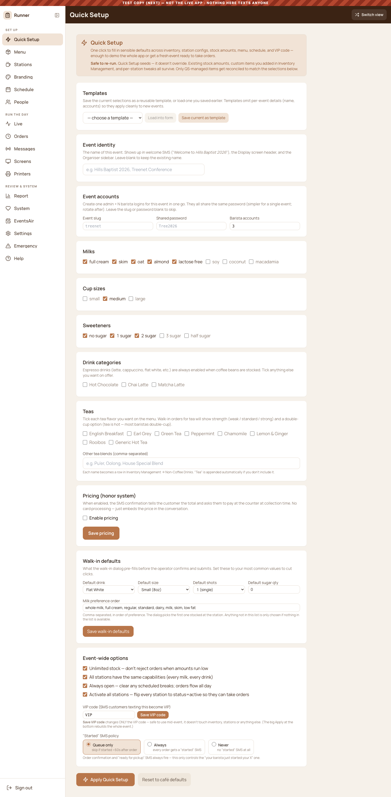
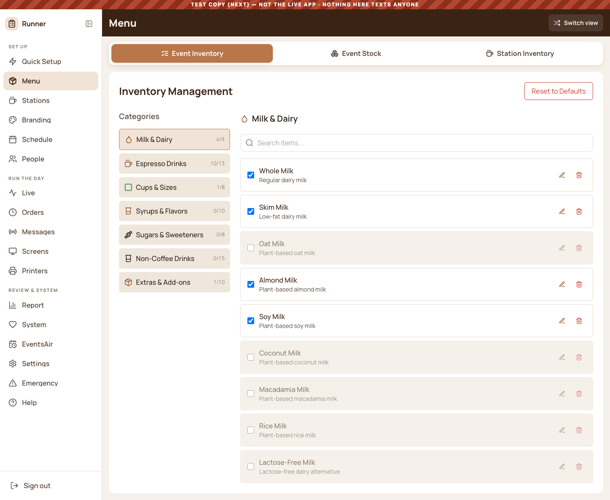
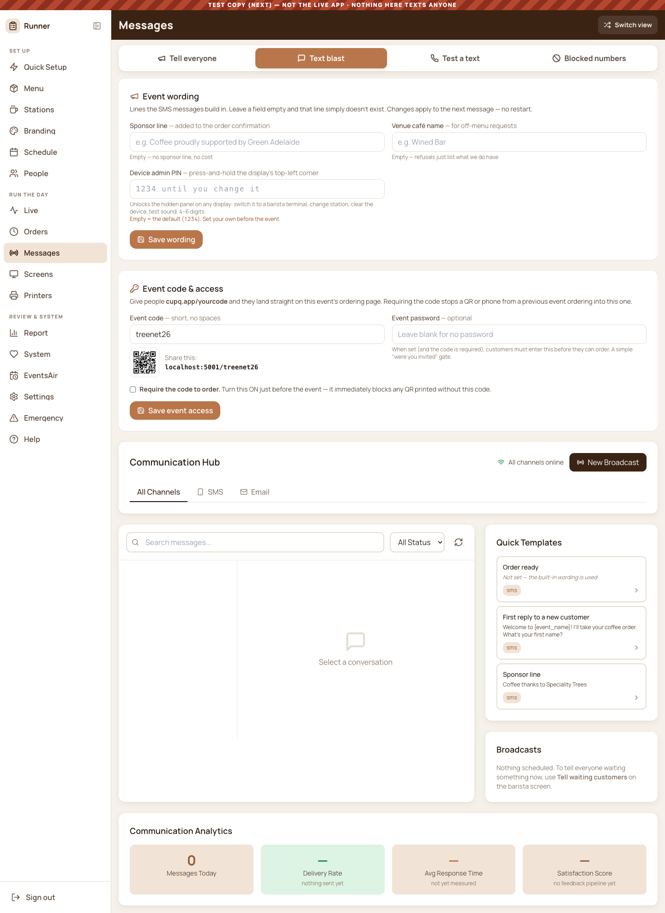

# What the screens look like now

Rebuilt from `scratchpad/capture/ui_sweep.js`. **Definition of done:**
`legacy: 0`, `selects: 0`, `inputs: 0` — *and somebody has looked at it.*

## The 30 runner destinations

All 30 clean as of 9 Sep 2026.

| Screen | legacy | cq | Shot |
| --- | ---: | ---: | --- |
| Quick Setup | 0 | 159 |  |
| Menu · Event Inventory | 0 | 117 |  |
| Menu · Event Stock | 0 | 217 |  |
| Menu · Station Inventory | 0 | 45 |  |
| Stations | 0 | 50 |  |
| Branding · Logo & look | 0 | 140 |  |
| Branding · Sponsors | 0 | 285 |  |
| Branding · Labels | 0 | 169 |  |
| Branding · Milk colours | 0 | 105 |  |
| Schedule | 0 | 67 |  |
| People | 0 | 48 |  |
| People · Roles & access | 0 | 56 |  |
| Live · Readiness | 0 | 117 |  |
| Live · Board | 0 | 108 |  |
| Live · Metrics | 0 | 103 |  |
| Orders · All | 0 | 736 |  |
| Orders · Groups | 0 | 62 |  |
| Messages · Tell everyone | 0 | 72 |  |
| Messages · Text blast | 0 | 105 |  |
| Messages · Test a text | 0 | 73 |  |
| Messages · Blocked numbers | 0 | 43 |  |
| Screens | 0 | 121 |  |
| Printers | 0 | 108 |  |
| Report | 0 | 194 |  |
| System · Health | 0 | 92 |  |
| System · Diagnostics | 0 | 138 |  |
| EventsAir | 0 | 81 |  |
| Settings | 0 | 64 |  |
| Emergency | 0 | 49 |  |
| Help | 0 | 44 |  |

## Beyond the 30

The sweep reads the live DOM, so it can only score what a nav click reaches.
These were converted in the same pass and are **not** in the table above —
see findings 14 and 15 in `FINDINGS_ROADMAP.md`.

**Dialogs** (all five were hand-rolled; there is a `Modal` primitive now):
Edit order, Move order, Message customer, Broadcast, Adjust wait time.

**Inside the barista interface:** the 86 board, Tools, Station printer panel,
Station capabilities editor, Station chooser, Queue intelligence, Station load
balancer, Station chat, Staff allocation, Multi-level inventory, Station
defaults, the in-progress order card, the rush mix strip, Ask-customer
controls, the customer questions list.

**Customer-facing:** the kiosk, the kiosk admin panel, How to order, the
mobile order page, My coffee, Cancel order, the barista Ask card, Sign, the
sponsor wall, the public display board.

**Sign-in and Unauthorized** — the first screen anyone sees. Sign-in scored
one grey class because its colours were inline hex in a `<style>` block.

**Deleted:** the old `OrganiserInterface` and its `Organiser` wrapper —
imported into App.js, never rendered, shipping in every download.
