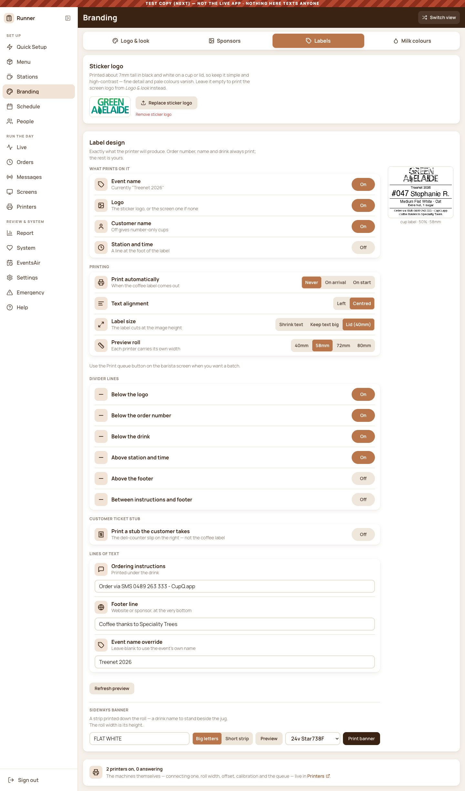
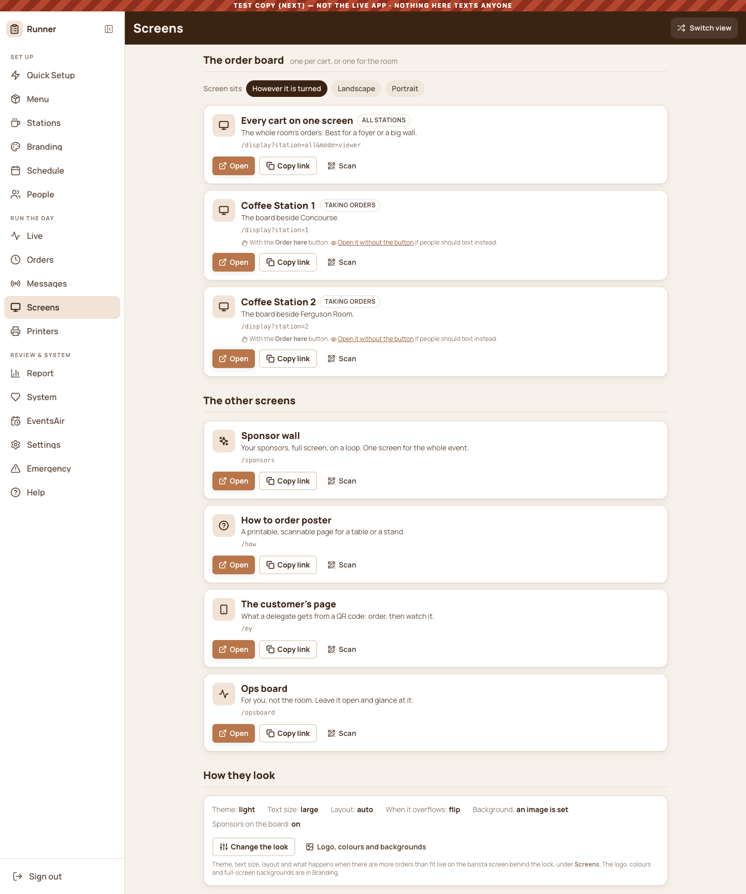
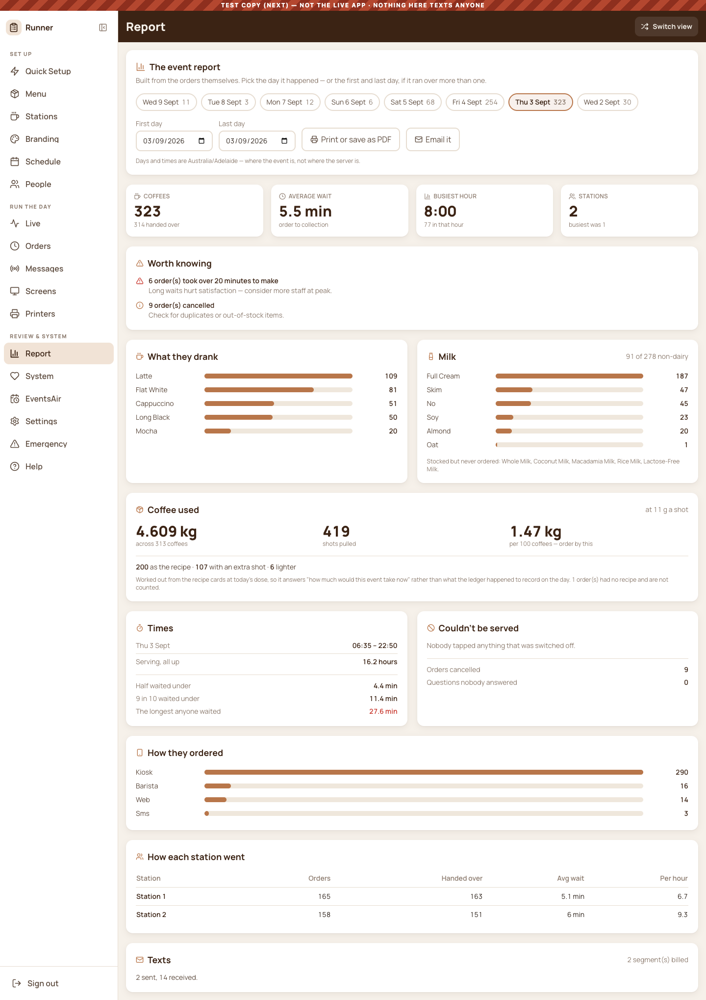

# The tidy-up: every screen, before and after

> Steve, holding two screenshots side by side: *"simple clean, branded UI vs
> cluttered complicated, non branded UI ... they often look similar to this."*

He was right, and the cause was small. The screen that looked good — the
Station Admin sheet — built its row pattern **inline**, twenty good lines that
nothing else could reach. Every other settings screen went on building its own
out of bare `<select>` and `<input>`, each with a paragraph of grey text
underneath.

`src/design/Settings.js` promotes that pattern so the rest can use it:
`SettingGroup`, `SettingRow`, `Toggle`, `Segmented`, `SelectRow`, `TextField`,
`SettingNote`. **The shape of a row is the whole idea**: an icon, a name, one
line of hint, and exactly one control. If a setting needs a paragraph, the
setting is wrong or the paragraph belongs in Help.

## How a screen is scored

`legacy` counts elements still carrying old Tailwind colours
(`bg-blue-500`, `text-gray-500` …). `cq` counts elements on the design system.
A converted screen reads **legacy 0**. Nothing here is a judgement call — the
numbers come from the live DOM, swept by `scratchpad/capture/ui_sweep.js`.

Last swept: 2026-09-09 · **4 of 30 done**

---

## Done (4)

### Branding · Labels

### Messages · Tell everyone

### Screens

### Report

---

## Still to do (26), worst first

| Screen | legacy | cq | selects | inputs |
| --- | ---: | ---: | ---: | ---: |
| [Orders · All](orders-all.png) | 321 | 34 | 2 | 1 |
| [Branding · Sponsors](branding-sponsors.png) | 213 | 36 | 16 | 35 |
| [Menu · Event Stock](menu-stock.png) | 130 | 35 | 0 | 14 |
| [Branding · Logo & look](branding-logo.png) | 97 | 36 | 1 | 24 |
| [Menu · Event Inventory](menu-inventory.png) | 78 | 35 | 0 | 10 |
| [Quick Setup](quickSetup.png) | 72 | 31 | 4 | 43 |
| [System · Diagnostics](system-diagnostics.png) | 63 | 34 | 1 | 0 |
| [Live · Readiness](live-readiness.png) | 55 | 35 | 1 | 6 |
| [Branding · Milk colours](branding-milk.png) | 54 | 36 | 0 | 9 |
| [System · Health](system-health.png) | 52 | 34 | 0 | 1 |
| [Messages · Text blast](messages-broadcast.png) | 48 | 36 | 1 | 7 |
| [Live · Board](live-board.png) | 46 | 35 | 0 | 0 |
| [Live · Metrics](live-metrics.png) | 42 | 35 | 0 | 0 |
| [EventsAir](eventsair.png) | 35 | 31 | 0 | 7 |
| [Schedule](schedule.png) | 32 | 31 | 0 | 1 |
| [Messages · Test a text](messages-test.png) | 28 | 36 | 7 | 7 |
| [Printers](printers.png) | 26 | 31 | 10 | 9 |
| [Stations](stations.png) | 18 | 31 | 0 | 0 |
| [Orders · Groups](orders-groups.png) | 15 | 34 | 4 | 5 |
| [Settings](settings.png) | 15 | 31 | 0 | 4 |
| [People · Roles & access](users-access.png) | 14 | 34 | 1 | 1 |
| [Emergency](emergency.png) | 12 | 31 | 0 | 0 |
| [Menu · Station Inventory](menu-stationInventory.png) | 9 | 35 | 0 | 0 |
| [Help](help.png) | 9 | 31 | 0 | 0 |
| [People](users-people.png) | 7 | 34 | 1 | 1 |
| [Messages · Blocked numbers](messages-blocked.png) | 5 | 36 | 0 | 1 |

Shots of these are in this folder too — they are the *before*.
